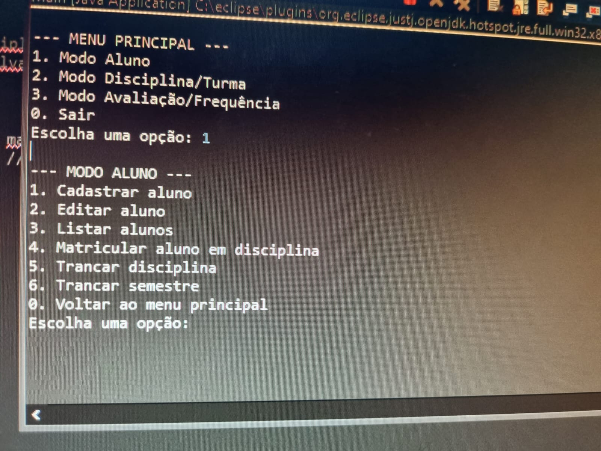
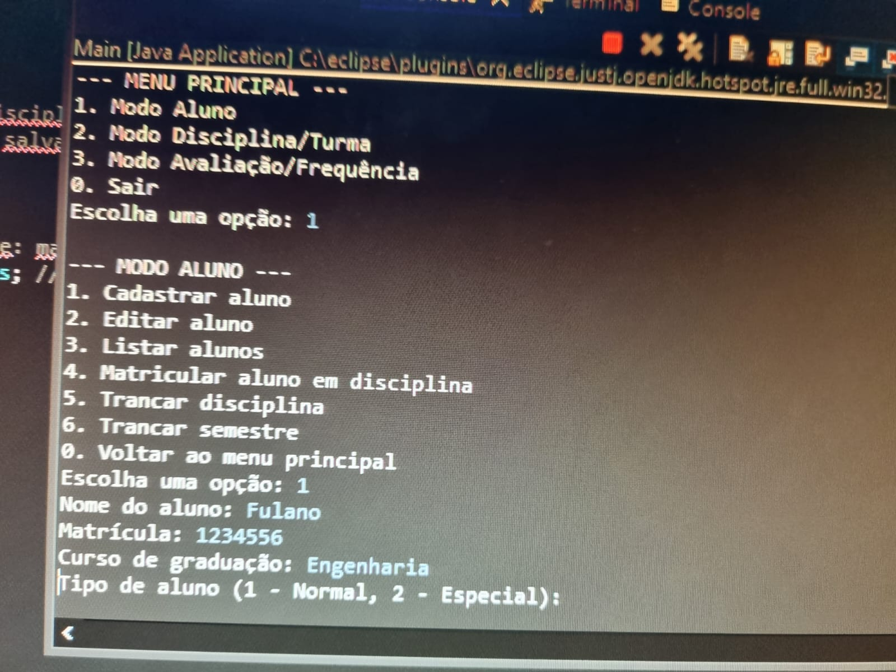
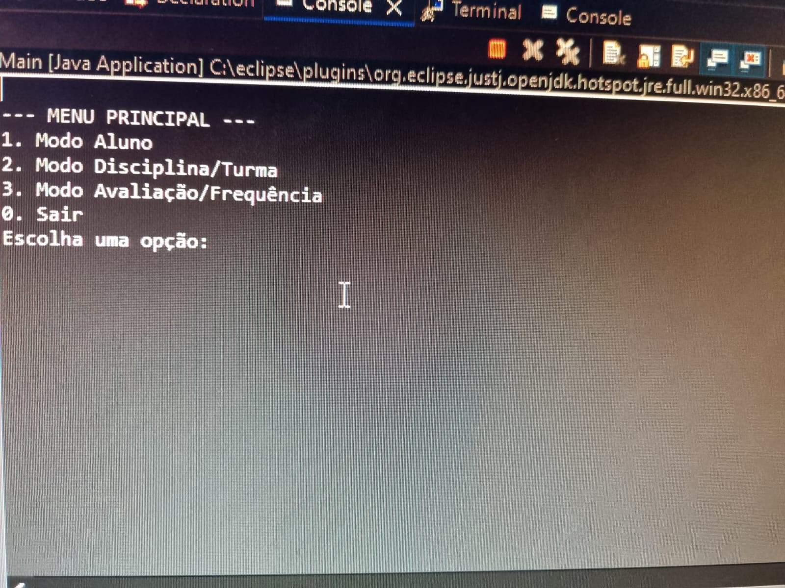

# Sistema Acadêmico - FCTE

## Descrição do Projeto

Desenvolvimento de um sistema acadêmico para gerenciar alunos, disciplinas, professores, turmas, avaliações e frequência, utilizando os conceitos de orientação a objetos (herança, polimorfismo e encapsulamento) e persistência de dados em arquivos.

O enunciado do trabalho pode ser encontrado aqui:
- [Trabalho 1 - Sistema Acadêmico](https://github.com/lboaventura25/OO-T06_2025.1_UnB_FCTE/blob/main/trabalhos/ep1/README.md)

## Dados do Aluno

- **Nome completo:** Rayca Yorrara Leite dos Santos
- **Matrícula:** 241025846
- **Curso:** Engenharia de Softaware 3 Semestre
- **Turma:** Turma 06

---

## Instruções para Compilação e Execução

1. **Compilação:**  
Não é necessário compilar manualmente.. O Eclipse compila automaticamente o código-fonte .java

2. **Execução:**  
   Clique com o botão direito no arquivo Main.java. Selecione a opção Run As → Java Application.

3. **Estrutura de Pastas:**  
  src/ → Pasta onde ficam todos os arquivos .java organizados por pacotes.

sistema/completo/menus/ → Pacote onde ficam as classes relacionadas aos menus (ex.: MenuAluno.java, SistemaAcademico2.java, etc).

modelo/ → Pacote onde ficam as classes de modelo de dados (ex.: Aluno.java, Disciplina.java, Turma.java, etc).

3. **Versão do JAVA utilizada:**  
  java 21

---

## Vídeo de Demonstração

- [Inserir o link para o vídeo no YouTube/Drive aqui]

---

## Prints da Execução

1. Menu Principal:  
   

2. Modo aluno:  
   

3. Modo Aluno:  
   

---

## Principais Funcionalidades Implementadas

-  [x] Cadastro, listagem, matrícula ~~e trancamento~~ de alunos (Normais e Especiais)
- [x] Cadastro de disciplinas e criação de turmas ~~(presenciais e remotas)~~
- [x] Matrícula de alunos em turmas, respeitando vagas e pré-requisitos
- [ ] Lançamento de notas e controle de presença
- [ ] Cálculo de média final e verificação de aprovação/reprovação
- [ ] Relatórios de desempenho acadêmico por aluno, turma e disciplina
- [ ] Persistência de dados em arquivos (.txt ou .csv)
- [x] Matrícula de alunos em turmas, respeitando vagas e pré-requisitos
- [x] Tratamento de duplicidade de matrículas
- [x] Uso de herança, polimorfismo e encapsulamento

---

## Observações (Extras ou Dificuldades)

- Tive dificuldade com relação ao tempo prosposto para realizar o trabalho devido as demais materias que devia estudar. Por isso o trabalho está incompleto.

---

## Contato

- [Opcional: E-mail pessoal do aluno: Ryorrara@gmail.com.]
